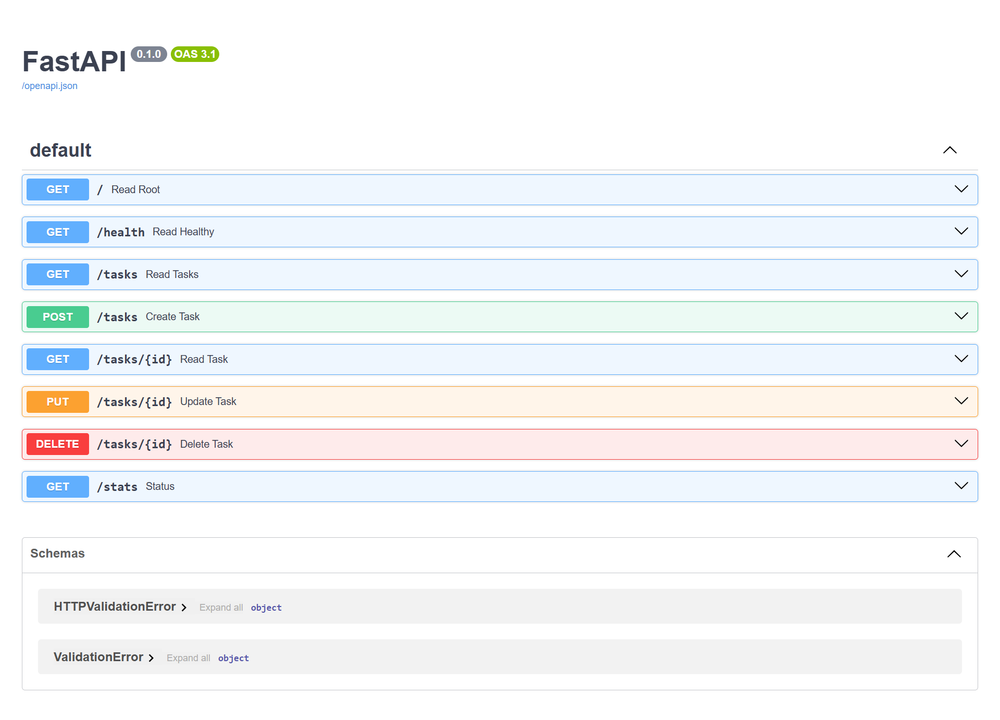

<div align="center">
# 🚀 FastAPI Task API
 
A simple RESTful Task Management API built with **FastAPI** as part of my backend learning journey.
 
[](https://www.python.org)
[](https://fastapi.tiangolo.com)
[](#-license)
 
</div>
This project demonstrates the fundamentals of building APIs using Python, including CRUD operations, HTTP status codes, path parameters, request bodies, and automatic API documentation with Swagger UI.
 
---

## ✨ Features
 
- ✅ View all tasks
- ✅ View a single task by ID
- ✅ Create a new task (with input validation)
- ✅ Update an existing task
- ✅ Delete a task
- ✅ Task statistics endpoint
- ✅ Automatic Swagger UI documentation
- ✅ Proper HTTP status codes and error handling
---
 
## 🛠️ Tech Stack
 
- Python 3
- FastAPI
- Uvicorn
---

## 📌 API Endpoints
 
| Method | Endpoint | Description | Success | Errors |
|---|---|---|---|---|
| GET | `/` | API information | 200 | — |
| GET | `/health` | Health check | 200 | — |
| GET | `/tasks` | Get all tasks | 200 | — |
| GET | `/tasks/{id}` | Get a task by ID | 200 | 404 if not found |
| POST | `/tasks` | Create a new task | 201 | 400 if title missing/empty |
| PUT | `/tasks/{id}` | Update a task | 200 | 400 invalid body · 404 not found |
| DELETE | `/tasks/{id}` | Delete a task | 204 | 404 if not found |
| GET | `/stats` | View task statistics | 200 | — |
 
---
 
## ▶️ Running the Project
 
### Clone the repository
 
```bash
git clone https://github.com/akramisha/FastAPI-CRUD-API.git
cd FastAPI-CRUD-API
```
 
### Install dependencies
 
```bash
pip install -r requirements.txt
```
 
### Start the server
 
```bash
uvicorn main:app --reload
```
 
The API will be available at:
```
http://127.0.0.1:8000
```
 
Swagger Documentation:
```
http://127.0.0.1:8000/docs
```
 
---
 
## 🧪 Example Usage
 
### Create a task
 
```bash
curl -i -X POST http://127.0.0.1:8000/tasks -H "Content-Type: application/json" -d "{\"title\":\"Buy milk\"}"
```
 
**Response:**
```
HTTP/1.1 201 Created
content-type: application/json
 
{"id":4,"title":"Buy milk","done":false}
```
 
### Get task statistics
 
**GET `/stats`**
```json
{
  "total": 3,
  "done": 2,
  "open": 1
}
```
 
### Requesting a task that doesn't exist
 
```bash
curl -i http://127.0.0.1:8000/tasks/99
```
 
**Response:**
```
HTTP/1.1 404 Not Found
content-type: application/json
 
{"detail":"Task with id 99 not found"}
```
 
---
 
## 📷 Swagger UI
 
<div align="center">

</div>
---
 
## 📚 What I Learned
 
Through this project, I learned:
 
- Building REST APIs with FastAPI
- CRUD operations (Create, Read, Update, Delete)
- Path parameters vs. request bodies — and the difference between reading data from the URL vs. from a JSON payload
- Working with lists and dictionaries as in-memory storage
- HTTP status codes (200, 201, 204, 400, 404) and when each one applies
- Exception handling with `HTTPException`, including writing specific, useful error messages
- Input validation before mutating stored data
- Auto-generated API documentation using Swagger UI
- Defining request body shapes with Pydantic models (`BaseModel`)
---
 
## 🗺️ Possible Next Steps
 
- [ ] Add a database (currently in-memory — data resets on restart)
- [ ] Add filtering (`GET /tasks?done=true`) and search (`GET /tasks?search=milk`)
- [ ] Add pagination for large task lists
- [ ] Write automated tests
---
 
## 📄 License
 
This project is created for learning purposes.
